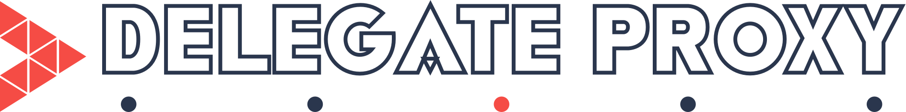

  

<p align="center">
<a href="https://travis-ci.org/ra1028/DelegateProxy"></a>
<a href="https://developer.apple.com/swift"></a>
<a href="http://cocoadocs.org/docsets/DelegateProxy"></a><br>
<a href="https://cocoapods.org/pods/DelegateProxy"></a>
<a href="https://github.com/Carthage/Carthage"></a>
<a href="https://codecov.io/gh/ra1028/DelegateProxy"></a>
<a href="https://github.com/ra1028/DelegateProxy/blob/master/LICENSE.md"></a>
</p>  

<H4 align="center">Proxy for receive delegate events more practically</H4>  

---

## About DelegateProxy  
__DelegateProxy__ enable you to receive delegate events by subscribed handler.  

This is generic version of DelegateProxy by [RxSwift](https://github.com/ReactiveX/RxSwift)  

It means be able to use in combination with any other reactive-framework like [ReactiveCocoa](https://github.com/ReactiveCocoa/ReactiveCocoa) or [SwiftBond](https://github.com/SwiftBond/Bond), etc.  

---

## Requirements
- Swift 2.2 / Xcode 7.3
- OS X 10.9 or later
- iOS 8.0 or later
- watchOS 2.0 or later
- tvOS 9.0 or later

---

## Installation

### [CocoaPods](https://cocoapods.org/)  
Add the following to your Podfile:
```ruby
use_frameworks!

target 'YOUR_TARGET_NAME' do
  pod 'DelegateProxy'
end
```
```sh
$ pod install
```

### [Carthage](https://github.com/Carthage/Carthage)  
Add the following to your Cartfile:
```ruby
github "ra1028/DelegateProxy"
```
```sh
$ carthage update
```

---

## Basic Example
Create `DelegateProxy` inherited class.  
```Swift
final class ScrollViewDelegateProxy: DelegateProxy, UIScrollViewDelegate, DelegateProxyType {
    func resetDelegateProxy(owner: UIScrollView) {
        owner.delegate = self
    }
}
```
It can be useful to implements extension.  
```Swift
extension UIScrollView {
    var delegateProxy: DelegateProxy {
        return ScrollViewDelegateProxy.proxyFor(self)
    }
}
```
You can receive delegate events as following.  
```Swift
scrollView.delegateProxy
    .receive(#selector(UIScrollViewDelegate.scrollViewDidScroll(_:))) { args in
        guard let scrollView: UIScrollView = args.value(0) else { return }
        print(scrollView.contentOffset)
}
```

---

## Custom Example
You can receive delegate events by `Receivable` protocol implemented class.  
Followings are examples of use DelegateProxy with reactive-frameworks.  

#### With [ReactiveCocoa](https://github.com/ReactiveCocoa/ReactiveCocoa)
Create receiver class.  
```Swift
final class RACReceiver: Receivable {
    let (signal, observer) = Signal<Arguments, NoError>.pipe()

    func send(arguments: Arguments) {
        observer.sendNext(arguments)
    }
}
```
Extension  
```Swift
extension DelegateProxy {
    func rac_receive(selector: Selector...) -> Signal<Arguments, NoError> {
        return RACReceiver().subscribeTo(proxy: self, selectors: selector).signal
    }
}
```
Receive events by streams.  
```Swift
scrollView.delegateProxy
    .rac_receive(#selector(UIScrollViewDelegate.scrollViewDidScroll(_:)))
    .map { $0.value(0, as: UIScrollView.self)?.contentOffset }
    .ignoreNil()
    .observeNext { print("ContentOffset: \($0)") }
```

#### With [SwiftBond](https://github.com/SwiftBond/Bond)
Create receiver class.  
```Swift
final class BondReceiver: Receivable {
    let subject = EventProducer<Arguments>()

    func send(arguments: Arguments) {
        subject.next(arguments)
    }
}
```
Extension  
```Swift
extension DelegateProxy {
    func bnd_receive(selector: Selector...) -> EventProducer<Arguments> {
        return BondReceiver().subscribeTo(proxy: self, selectors: selector).subject
    }
}
```
Receive events by streams.  
```Swift
scrollView.delegateProxy
    .bnd_receive(#selector(UIScrollViewDelegate.scrollViewDidScroll(_:)))
    .map { $0.value(0, as: UIScrollView.self)?.contentOffset }
    .ignoreNil()
    .observeNew { print("ContentOffset: \($0)") }
```

---

## Contribution  
Welcome to fork and submit pull requests!!  

Before submitting pull request, please ensure you have passed the included tests.  
If your pull request including new function, please write test cases for it.  

---

## License  
DelegateProxy is released under the MIT License.  
